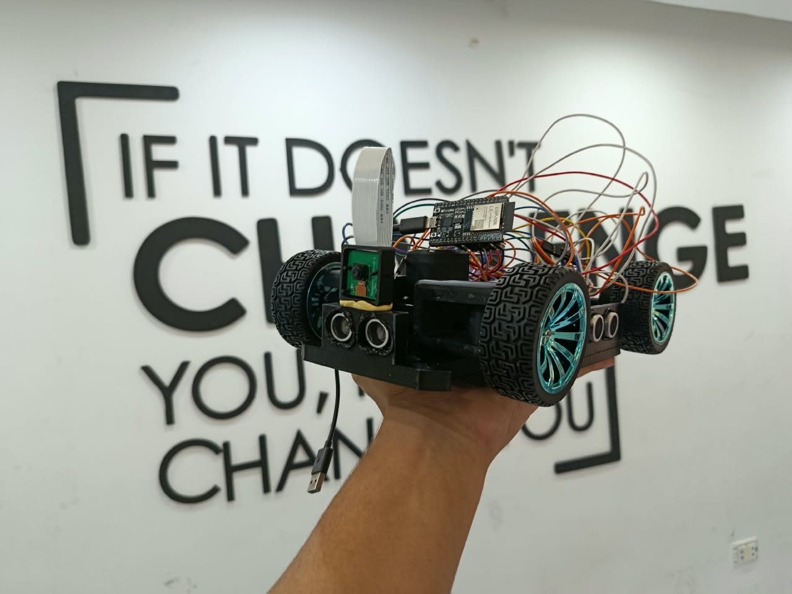
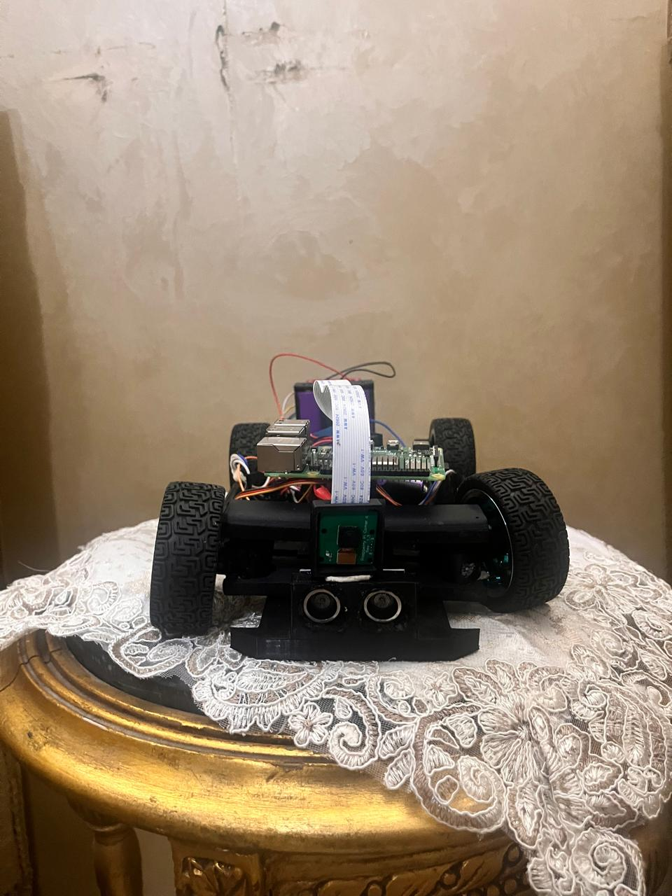
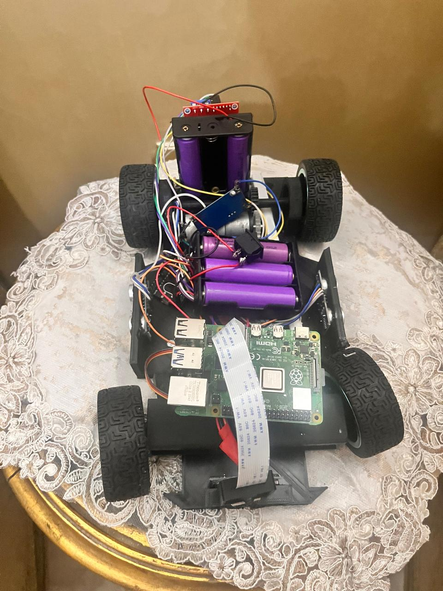
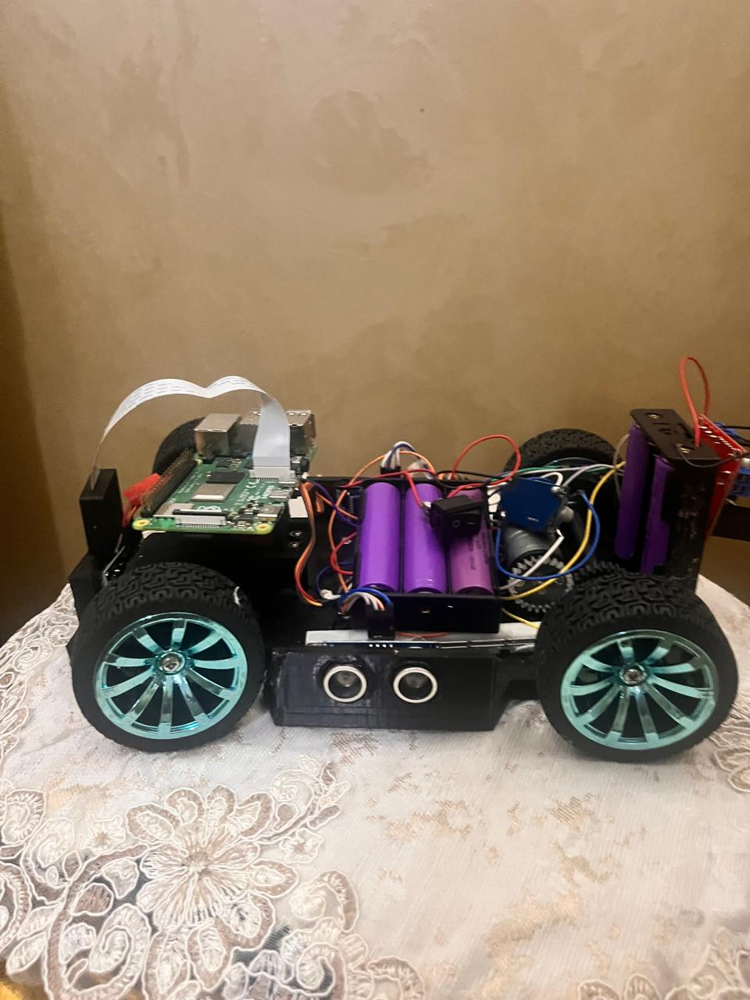
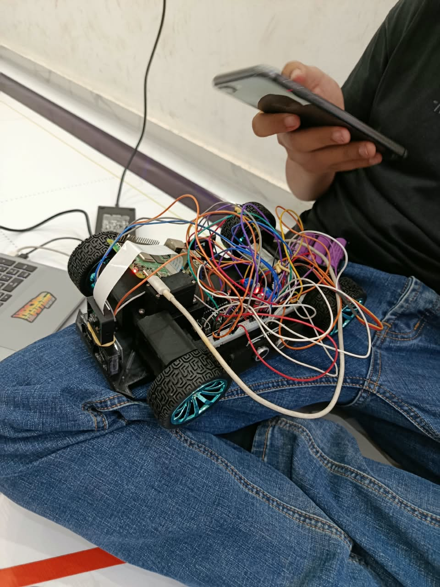

# 📸 Vehicle Photos

This folder contains high-quality photos of Team RCBC's WRO Future Engineers robot, showcasing its compact design, component layout, and structural engineering. Each photo demonstrates key systems related to **mobility management**, **power and sense management**, and **obstacle management**.

---

## 🖼️ Photo Gallery

### 🚘 Complete Vehicle Overview - `Car_Photo.jpeg`
**Focus: Complete Vehicle Design & System Integration**
- Compact, lightweight 3D-printed chassis structure
- Clean modular integration of electronics and mechanics
- Front vision and sensor array placement

  

---

### 📷 Front View - `Front_View.jpeg`
**Focus: Vision System & Primary Obstacle Detection**
- **Raspberry Pi Camera Module 2 (8MP)** - Main sensor for color space analysis and sign detection
- **HC-SR04 Ultrasonic Sensor** - Real-time distance measurement for obstacle detection
- Rigid camera mounting and protective bumper design

  

---

### 🔝 Top View - `Top_View.jpeg`
**Focus: Electronics Architecture & Power Distribution**
- **Raspberry Pi 4 Model B (4GB)** - Primary vision processor
- **L298N Motor Driver & Buck Converters** - Power regulation and motor control
- **Modular Socket Wiring** - Organized routing for signal integrity and quick maintenance

  

---

### 📐 Side View - `Side_View.jpeg`
**Focus: Mobility Management & Side Proximity Sensing**
- **Ackermann Steering Geometry** - Precision mechanical steering assembly
- **Side Sensors** - Dedicated distance detection for wall-following and parallel parking
- **Rear Drive Train** - Efficient power transmission setup

  

---

### 🛠️ Hardware Testing - `While_Working.jpeg`
**Focus: Physical Realization & Bench Testing**
- Live testing and calibration of electronics
- Sensor validation and hardware integration stage

  

---

## 📝 Notes
- All photos were taken in optimal lighting conditions to highlight structural details and wiring paths.
- High-resolution view allows inspection of mechanical components, steering mechanisms, and electrical routing.
- Check out performance videos and demonstrations on our 🎥 [YouTube Channel](https://www.youtube.com/@WRO_RCBC_EGYPT).

---

### 🔗 Related Documentation
- ⚙️ **Mechanical Systems & CAD Files**: [Mechanical Design Documentation](../Mechanical_Design/README.md)
- ⚡ **Circuit Diagrams & Schematics**: [Schemes Documentation](../schemes/README.md)
- 💻 **Software & Algorithms**: [Software Documentation](../software/README.md)
