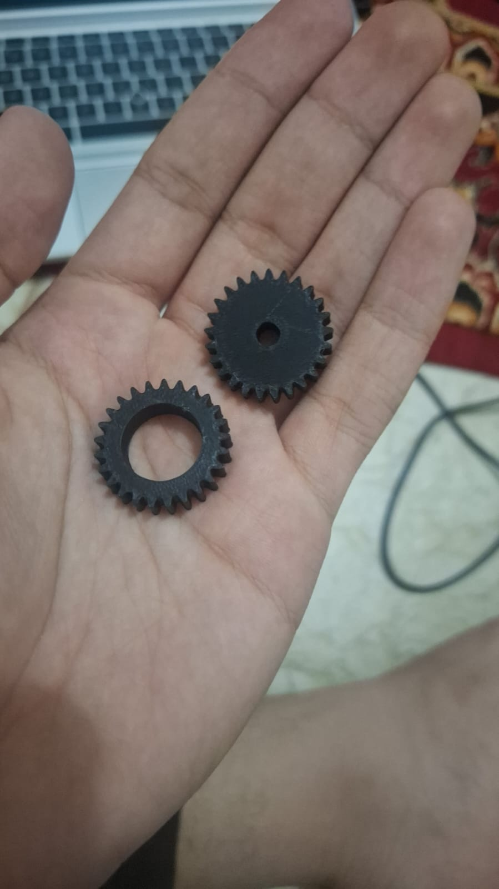
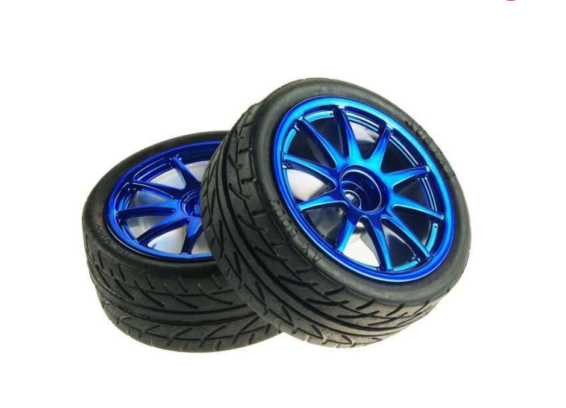
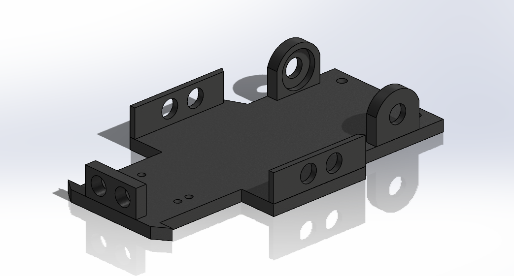
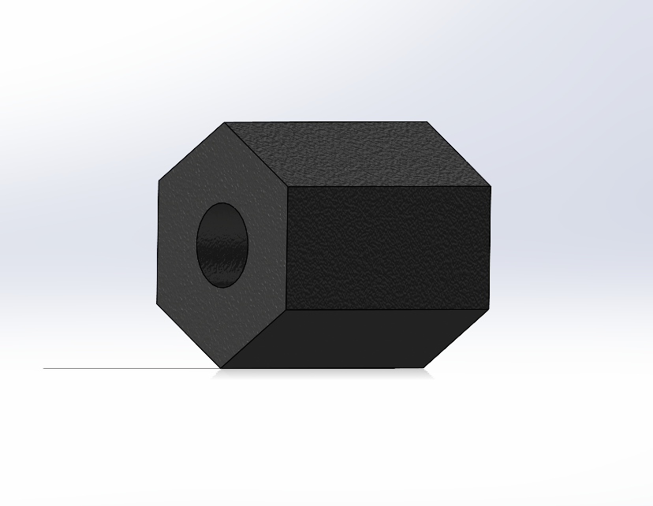
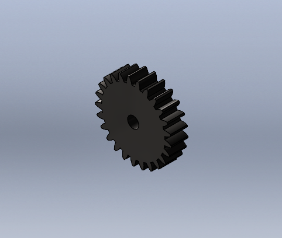
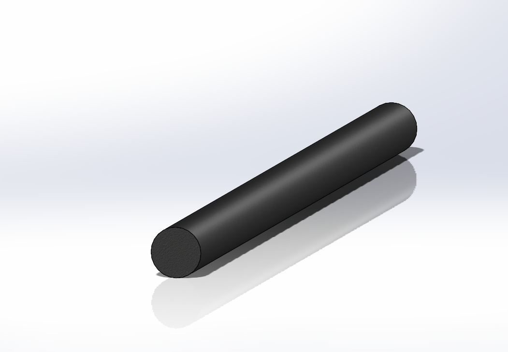
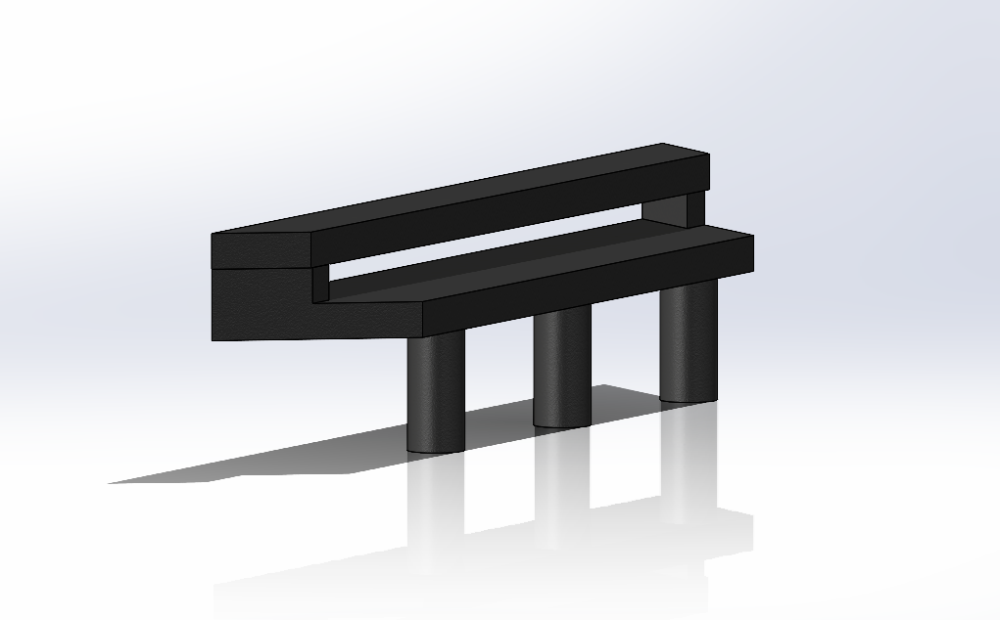

# Models Documentation

This folder contains the complete 3D CAD models and manufacturing files for Team RCBC's WRO 2026 Future Engineers robot. All mechanical components were custom-designed and manufactured in-house to achieve our goal. 

## 🎯 Mechanical Design Philosophy

  

  <em>Direct comparison: 1) CAD design visualization</em>

## ⚙️ Core Mechanical Systems

### 🔄 Custom Ackermann Steering Geometry
The steering system implements true Ackermann principles where each wheel points toward a common center point during turns, minimizing tire scrub and maximizing stability.

  <table align="center">
    <tr>
      <td align="center">
        
      </td>
      <td align="center">
        
      </td>
    </tr>
    <tr>
      <td align="center" colspan="2">
        
      </td>
    </tr>
  </table>

  <em>1) Real-time CAD simulation demonstrating steering mechanism operation • 2) Engineering calculations showing Ackermann geometry and optimal turning radius</em> 
  <em>Higher quality video: <a href="../video/3d_CAD_motion.mp4">3d_CAD_motion.mp4</a></em>

**Engineering Progress & Refinement:**
- **Initial Approach**: Print-in-place Ackermann steering with integrated moving parts
- **Performance Finding**: Initial excellent tolerance degraded after extensive testing causing wheel wiggle
- **Final Solution**: Multi-component steering with 3 M2 screws and 3 M2 lock nuts ensuring permanent precision
- **True Ackermann Geometry**: Each wheel points toward common center point during turns for minimal tire scrub

### 🔧 4-Gear Mechanical Differential
Our custom differential ensures smooth power distribution to both rear wheels during turns, preventing wheel slip and maintaining traction during complex maneuvers.

  <table align="center">
    <tr>
      <td align="center">
        
      </td>
      <td align="center">
         
        
      </td>
    </tr>
  </table>

  <em>1) Physical differential test demonstrating independent wheel rotation • 2) CAD views showing 2-gear differential assembly from multiple angles</em> 
  <em>Higher quality video: <a href="../video/differential_test.mp4">differential_test.mp4</a></em>

**Gear System Specifications:**
- **Spur Gear Reduction**: 25-tooth and 25-tooth providing optimized 1:1 ratio
- **Precision Manufacturing**: 100% infill for maximum strength and durability
- **Efficiency Optimization**: Minimal power loss through precisely calculated gear meshing

### 🏗️ Chassis and Structural Design
The main chassis integrates all mechanical and electronic systems while maintaining structural integrity and achieving minimal weight through strategic design.

  <table align="center">
    <tr>
      <td align="center">
        
      </td>
      <td align="center">
         
        
      </td>
    </tr>
  </table>

  <em>1) Extensive chassis design evolution through multiple iterations • 2) CAD views showing main chassis structure from different perspectives</em>

**Structural Engineering Elements:**
- **Integrated Component Mounting System**: Precision slots and holders for Electronics, servo, motor, and battery
- **Optimized Weight Distribution**: Strategic mass placement ensuring stable navigation and quick response
- **Bearing Integration**: two precision bearings (one per wheel) for smooth rotation with minimal friction
- **Access and Maintenance Design**: Strategic openings enabling easy component replacement and field adjustments

## 🏭 Manufacturing Process & Engineering Solutions

### 🖨️ 3D Printing Equipment & Material Strategy
We conducted extensive testing across multiple printing technologies on The internet and the market to achieve optimal results.

**CAD & Slicing Software Integration**:
- **Design Platform**: ***SolidWorks*** for comprehensive 3D modeling, simulation, and engineering analysis
- **Slicing Software**: ***UltiMaker Cura*** for optimized print preparation and manufacturing parameter management
- **Workflow Integration**: Seamless transition from CAD design to manufacturing-ready 3MF files

**Printing Equipment Evaluation:**
| Printer | Technology | Primary Usage | Materials Tested | Key Findings |
|---------|------------|---------------|------------------|--------------|
| **Ender 3v3** | FDM (Fused Deposition Modeling) | Final production | Hyper ABS, ABS+ | **Optimal Choice** - Reliable performance with ABS materials |
| **Zaxe Z3S** | FDM (Fused Deposition Modeling) | Development phase | PLA, ABS | Excellent precision and reliability |
| **Bambu Lab A1** | FDM (Fused Deposition Modeling) | Rapid prototyping | PLA | Exceptional speed for design iterations |
| **Markforged Mark Two** | CFR (Continuous Fiber Reinforcement) | Advanced testing | Onyx (Nylon+CF) | Limited by proprietary Eiger software constraints |
| **Formlabs Form 3B+/3+** | SLA (Stereolithography) | Detail testing | SLA Resins | Superior detail but insufficient impact strength and resin alternatives|

### 🛠️ Comprehensive Material Selection Process
**Final Material: PLA+ from Patreon**  
Selected for superior layer adhesion, impact resistance, and thermal stability required for competition conditions.

**Material Testing Results & Rationale:**
- ✅ **FDM - PLA+ (Production Choice)**: Optimal strength-to-weight ratio, excellent layer bonding, competition-ready durability
- ✅ **FDM - Hyper ABS (Development Phase)**: Good performance used during national tournament
- ❌ **FDM - ABS+**: Adequate for initial prototyping but insufficient impact resistance for competition use
- ❌ **FDM - PETG**: Challenging dimensional accuracy and stringing issues affecting gear performance
- ❌ **SLA - Resin**: Exceptional detail resolution but too brittle for structural components under stress, plus limited availability for reproduction

**Selection Philosophy**: Chosen materials prioritize **accessibility** and **reproducibility** alongside performance, ensuring other teams can easily replicate our design using commonly available FDM technology rather than specialized industrial equipment.

**Technology Overview:**
- **FDM (Fused Deposition Modeling)**: Material extrusion through heated nozzle, ideal for functional parts
- **SLA (Stereolithography)**: UV laser curing liquid resin, excellent for high-detail prototypes  
- **CFR (Continuous Fiber Reinforcement)**: Composite printing with continuous fiber strands for maximum strength

### 🔥 Engineering Challenge: ABS Printing Without Dedicated Enclosure
**Problem Identification**: Printing ABS material on Ender 3v3 without dedicated heated enclosure caused warping and layer separation issues.

**Innovative Solution**: Developed room-scale thermal management system using the entire workspace as a controlled environment.

**Thermal Management Process:**
1. **Environmental Pre-conditioning**: Maintain ambient temperature at 28-32°C throughout printing process
2. **Stable Printing Execution**: Complete ABS printing with consistent thermal environment minimizing thermal gradients
3. **Controlled Gradual Cooling**: Allow natural cooling with minimal ventilation to prevent rapid temperature changes
4. **Stabilized Part Extraction**: Remove finished components only after complete thermal stabilization
5. **Process Repeatability**: Continue manufacturing sequence using identical thermal management for consistency

**Optimized Printing Parameters:**
- **Layer Resolution**: 0.08mm–0.1mm for dimensional accuracy and surface finish
- **Infill Strategy**: 30-40% for structural chassis components, 100% for gears and high-stress elements
- **Temperature Control**: Nozzle 250-260°C, Bed 80-85°C for optimal layer adhesion
- **Nozzle Configuration**: 0.4mm standard nozzle (available equipment)
- **Support Strategy**: Tree supports preferred for optimal material usage and clean removal

**Advanced Speed Settings:**
- **Print Speeds**: Outer wall 200 mm/s, Inner walls 300 mm/s, Sparse infill 200 mm/s
- **Specialized Settings**: Top surface 200 mm/s, Gap infill 200 mm/s, Support 150 mm/s
- **Quality Optimization**: Support interface 80 mm/s, First layer 60 mm/s
- **Travel & Overhangs**: Travel speed 500 mm/s, Overhang reduction 30-20-10%
- **Bridge Control**: External bridges 25 mm/s, Internal bridges 160 mm/s

### 📁 3amf File Format Advantage
**Why 3amf for Maximum Reproducibility:**
- **Universal Compatibility**: Works across all printer brands and slicing software, unlike machine-specific G-code
- **Complete Scene Preservation**: All print settings, orientations, and arrangements embedded
- **Advanced Feature Support**: Custom support placements, support settings, and manual modifications preserved
- **Color & Material Information**: Visual specifications maintained for consistent results
- **Exact Alignment**: Bed positioning and part orientation preserved for identical outcomes
- **One-Click Manufacturing**: Direct import with all manufacturing parameters intact for perfect reproduction

## 🧩 Comprehensive Assembly Guide

### 📋 Detailed Step-by-Step Assembly Process

  

  <em>Intermediate assembly stage showing mechanical systems integration and component relationships</em>

**Phase 1: Drive Train Assembly & Power Transmission**
1. **Differential System Installation**: Precision alignment of 4-gear mechanism ensuring smooth power transfer
2. **Motor Integration**: Secure mounting of 450 RPM JGA270-370 motor with custom enclosure using M2 hardware
3. **Gear Meshing Verification**: Ensure proper engagement of 25T and 26T spur gears with optimal backlash

**Phase 2: Steering System Integration & Control**
1. **Ackermann Mechanism Assembly**: Install steering arms and linkage with 4 M2 screws and 2 M2 lock nuts
2. **Servo Integration**: Connect Feetech Mg966R servo to steering mechanism with precise alignment
3. **Back Wheel System**: Install bearings and Back rims ensuring smooth rotation and minimal play

**Phase 3: Chassis Completion & System Integration**
1. **Electronic Platform Mounting**: Secure Bread boards with all electronic systems in designated slots
2. **Power System Installation**: Mount LiPo battery in optimized weight distribution position
3. **Final Mechanical Validation**: Comprehensive check of all systems for optimal performance and reliability

## 🔄 Component Development & Engineering Iteration

  

  <em>Comprehensive component evolution demonstrating our iterative design process across gear systems, steering mechanisms, and structural elements</em>

**Development Scope & Engineering Iterations:**
- **Gear System Evolution**: Multiple generations optimizing tooth profile, meshing efficiency, and strength
- **Steering Mechanism Refinement**: Various iterations achieving precision control with minimal mechanical play
- **Structural Component Optimization**: Chassis, rims, and mounting systems refined through performance testing
- **Integration Validation**: Continuous testing ensuring component compatibility and system reliability
- **Print-in-Place Validation**: Manufacturing process refinement for optimal production quality

## 🎯 Advanced Wheel & Tire System Engineering

### 🔍 Comprehensive Tire Analysis & Performance-Based Selection

  <table align="center">
    <tr>
      <td align="center" width="40%">
        
      </td>
      <td align="left" width="60%">
        <h4>🏎️ Why On-Road Performance Tires?</h4>
        <ul>
          <li><strong>Low-Profile Tread:</strong> Designed for high-speed stability and maximum traction on smooth surfaces.</li>
          <li><strong>Aluminium Rim Structure:</strong> Provides zero flex under high torque compared to flexible plastic wheels.</li>
          <li><strong>Standard Hex Hub:</strong> Ensures precise power transfer from motors without rotational slip.</li>
        </ul>
      </td>
    </tr>
  </table>

**Technical Tire Comparison & Engineering Analysis:**

| Engineering Aspect | Our Robotic Wheel TIre | Custom Silicone Tires |
|-------------------|------------|----------------------|
| **Material Composition** | SEBS (Styrene-Ethylene-Butylene-Styrene) | Custom silicone compound formulation |
| **Theoretical Traction** | Good predictable performance | Higher theoretical coefficient |
| **Actual Performance** | Optimal for our weight class | Similar results despite theoretical advantage |
| **Design Compatibility** | Perfect fit with custom rims | Required significant rim redesign |
| **Manufacturing Consistency** | Excellent quality control | Variable performance between batches |
| **Weight Impact** | Minimal additional mass | Slightly increased rotational mass due to a larger inner rim with more filling, necessary for better stretching of the silicone tire |

**Final Engineering Selection: Robotic Wheel Tire**
- **Optimal Dimensions**: 65mm diameter × 28mm width fitting our size constraints
- **Key Design Feature**: Circumferential center ridge providing stability and predictable handling
- **Performance Characteristics**: Consistent traction with minimal rolling resistance
- **Reliability Assurance**: Proven durability under extended competition conditions

### 🎯 Performance Analysis: Why Theory Didn't Match Reality

<table>
<tr>
<td><strong>🏋️ Weight Dynamics</strong> 130g total weight changes traction physics</td>
<td><strong>⚡ Speed Factors</strong> 1.4 m/s momentum dominates cornering</td>
</tr>
<tr>
<td><strong>🎯 Precision Engineering</strong> Near-zero mechanical play in systems</td>
<td><strong>📊 Test Results</strong> Identical lap times with both tires</td>
</tr>
</table>

**Ultra-Lightweight Physics Revolution:**
- **Mass Revolution**: At 800g, traditional tire traction models don't apply
- **Center of Gravity Mastery**: Extremely low CG reduces dependency on tire grip
- **Weight Distribution Science**: Strategic mass placement provides inherent stability

**High-Speed Momentum Dominance:**
- **Physics Reality**: At 1.5 m/s operational speed, momentum overpowers traction benefits
- **Cornering Truth**: Sharp turns rely on precise steering, not tire compound
- **Performance Data**: Both tires demonstrated identical competition performance

**Precision Engineering Advantage:**
- **Zero-Play Systems**: Our mechanical design eliminates steering and drive train slack
- **Predictable Response**: Vehicle handles identically regardless of tire material
- **Algorithm Optimization**: Navigation tuned for positional accuracy over traction dependence

**The Engineering Conclusion:**
While silicone promised higher friction coefficients, our ultra-lightweight, high-precision platform operating at speed revealed that traditional tire performance metrics become secondary. The combination of minimal mass, optimized dynamics, and precision control systems created a scenario where both options performed identically in real-world testing, making consistency and compatibility the deciding factors.

## 📊 Engineering Calculations & Performance Validation

**Motor & Drive Train Engineering Analysis:**
- **Motor Specification**: 450 RPM N20 DC motor with integrated Hall effect magnetic quadrature encoder
- **Gear Reduction System**: 1:1 ratio through custom spur gear design providing optimal torque-speed balance
- **Wheel RPM Calculation**: 450 RPM derived through:
    - Wheel RPM = Motor RPM × Gear Ratio = 450 × (1/1) = 450 RPM
- **Theoretical Maximum Speed**: 1.53 m/s calculated through:
    - Wheel radius = 65mm / 2 = 32.5mm = 0.0325m
    - Speed = (2 × π × wheel radius) × (Wheel RPM / 60)
    - Speed = (2 × π × 0.0325) × (450 / 60) ≈ 1.53 m/s
- **Operational Speed Selection**: 1.4 m/s via PWM control providing optimal stability and control response
- **Speed Optimization**: Based on comprehensive calculations comparing wheel/tire sizes and motor speeds for the 3m × 3m game field. Development comparisons available at
- 

  <table align="center">
    <tr>
      <td align="left">
        <h4>⚡ Speed Calculations (450 RPM Motor & 1:1 Gear Ratio)</h4>
        
<strong>Formula:</strong> <code>v = (π × d / 100) × (RPM / 60)</code>

        <ul>
          <li><strong>Motor Base Speed:</strong> 450 RPM</li>
          <li><strong>Gear Ratio:</strong> 1:1 → <strong>Wheel Speed:</strong> 450 RPM</li>
          <li><strong>Wheel Diameter:</strong> 65 mm (6.5 cm)</li>
          <li><strong>Theoretical Speed:</strong> <strong>1.53 m/s</strong></li>
        </ul>
      </td>
    </tr>
  </table>

**Structural & Performance Engineering Validation:**
- **Motor Torque Analysis**: ~1.25 Nm at 12V providing sufficient force for 800g vehicle mass and acceleration requirements
- **Bearing System Design**: Optimized for minimal friction, long-term reliability, and precise wheel alignment
- **Steering Load Calculations**: Ackermann mechanism perfectly matched to servo torque capabilities and response requirements
- **Impact Resistance Validation**: Comprehensive testing under competition conditions confirming structural integrity

## 📁 Complete Manufacturing File Repository

### 🎯 Comprehensive 3D Printing Files & Assembly Specifications
*All files provided in **3MF format** for maximum reproducibility across different printers and slicers.* 
*Quantities listed are for one complete vehicle assembly*

| Component | File | Quantity | CAD Preview | Description |
|-----------|------|----------|-------------|-------------|
| **Main Chassis** | [`RCBC Chassis.3MF`](RCBC%20Chassis.3MF) | 1 |  | Primary structure with integrated mounting system |
| **Motor Bracket** | [`JGA25-370 motor bracket.step.3MF`](JGA25-370%20motor%20bracket.step.3MF) | 1 |  | Mounting bracket specifically designed for JGA25-370 motor |
| **Ackerman Axle** | [`Ackerman Axle.3MF`](Ackerman%20Axle.3MF) | 1 |  | Main steering linkage for Ackermann geometry |
| **Knuckle Joint** | [`Knuckle_Joint_boze.3MF`](Knuckle_Joint_boze.3MF) | 2 |  | Steering knuckle joints for front wheels |
| **Rotation Left** | [`Rotation_Left.3MF`](Rotation_Left.3MF) | 1 |  | Left side steering rotation component |
| **Rotation Right**| [`Rotation_Right.3MF`](Rotation_Right.3MF) | 1 |  | Right side steering rotation component |
| **Servo Connector** | [`Servo_Connector.3MF`](Servo_Connector.3MF) | 1 |  | Linkage connecting the steering servo to the axle |
| **Spur Gear** | [`spur gear_am.3MF`](spur%20gear_am.3MF) | 1 |  | Main torque transmission spur gear |
| **Drive Shaft** | [`Shaft.3MF`](Shaft.3MF) | 1 |  | Main mechanical drive transmission shaft |
| **Camera Casing** | [`camera casing 1.3MF`](camera%20casing%201.3MF) | 1 |  | Enclosure and protection for the vision system |
| **Rear Spoiler** | [`spoiler.3MF`](spoiler.3MF) | 1 |  | Aerodynamic rear spoiler structure |

## 🚀 Engineering Design & Development Process

### 🔄 Comprehensive Iterative Engineering Approach

1. **Conceptual Design & Requirements Analysis**
   - Comprehensive size constraint analysis and optimization
   - True Ackermann steering geometry implementation and validation
   - Strategic component integration planning and spatial optimization

2. **Precision CAD Modeling & Engineering Simulation**
   - Detailed modeling in ***SolidWorks*** with manufacturing considerations
   - Motion simulation and validation for steering and drive train systems

3. **Prototyping & Performance Optimization**
   - Multiple iterations for mechanical tolerance refinement and optimization
   - Comprehensive material testing across various options and conditions
   - Print-in-place component validation and manufacturing process refinement

4. **Production Engineering & System Validation**
   - Optimized printing parameters implementation for production quality
   - Comprehensive assembly procedure development and documentation
   - Competition condition performance testing and validation

## ✅ Engineering Validation & Testing Protocols

### 🧪 Mechanical System Verification & Performance Testing

- **Differential Operation Validation**: Comprehensive testing of smooth torque distribution under various load conditions
- **Steering Geometry Confirmation**: Physical validation of true Ackermann principles in operational implementation
- **Structural Integrity Assessment**: Testing under various surface irregularities to confirm reliability, focusing on the effects of small bumps on a lightweight vehicle.
- **Bearing System Performance**: Long-term testing confirming smooth operation, minimal friction, and reliability

### 🏆 Competition Readiness & Reliability Engineering

- **Regulation Compliance Verification**: Comprehensive adherence to WRO vehicle specifications including 300x200mm maximum dimensions, 1.5kg maximum weight, 4-wheel design with one driving axle and one steering actuator
- **Operational Reliability Demonstration**: Extended testing showing consistent performance under competition pressure
- **Maintenance & Service Protocols**: Established procedures for competition-time adjustments and repairs
- **Backup System Preparation**: Redundant components and systems prepared for competition requirements

---

This comprehensive mechanical documentation provides complete transparency into our design process, manufacturing methods, validation procedures, and engineering decision-making. Every aspect of our mechanical system has been optimized for the unique challenges of autonomous navigation in the WRO 2025 Future Engineers category, enabling exact duplication while demonstrating engineering excellence through detailed component specifications, assembly instructions, performance data, and real-world validation.

For electrical systems documentation: [Schemes Documentation](../schemes/README.md)  
For software implementation and algorithms: [Software Documentation](../src/README.md)  
For performance demonstrations: [Video Documentation](../video/README.md)  
For additional resources and photos: [Other Documentation](../other/README.md)
