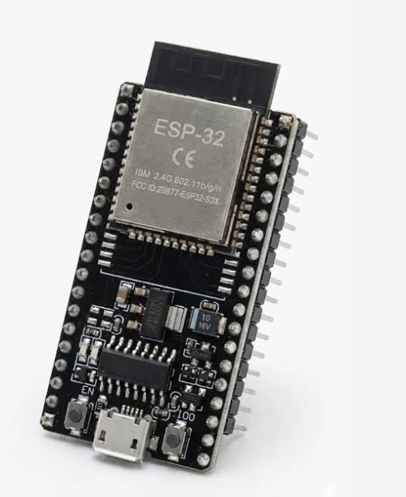
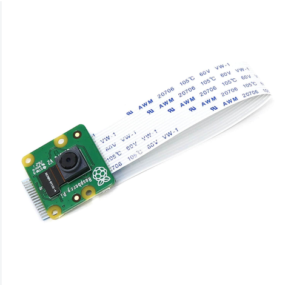
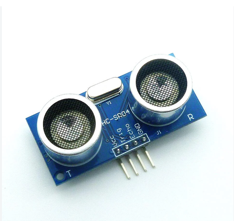
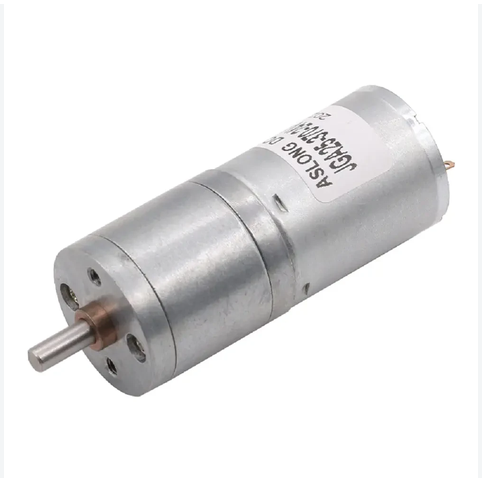
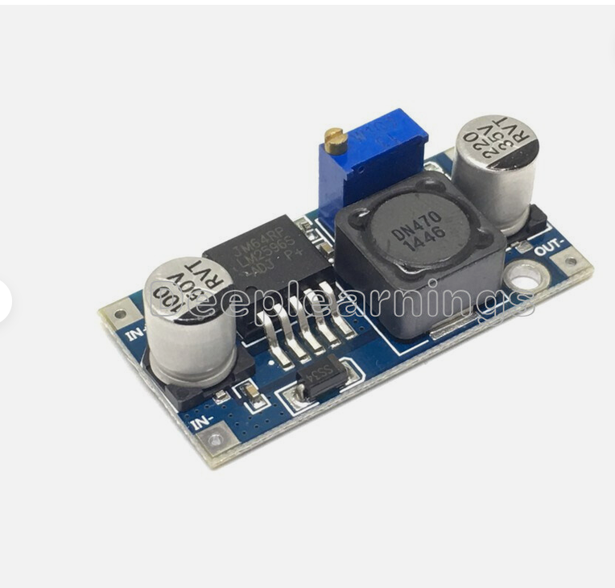
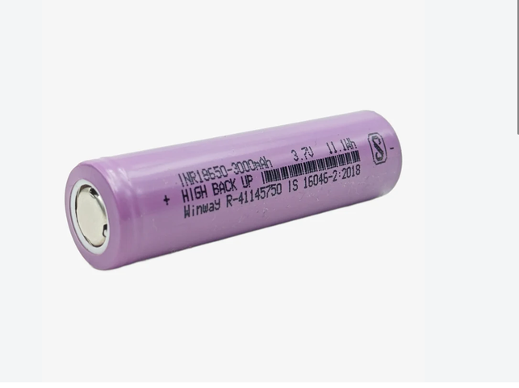
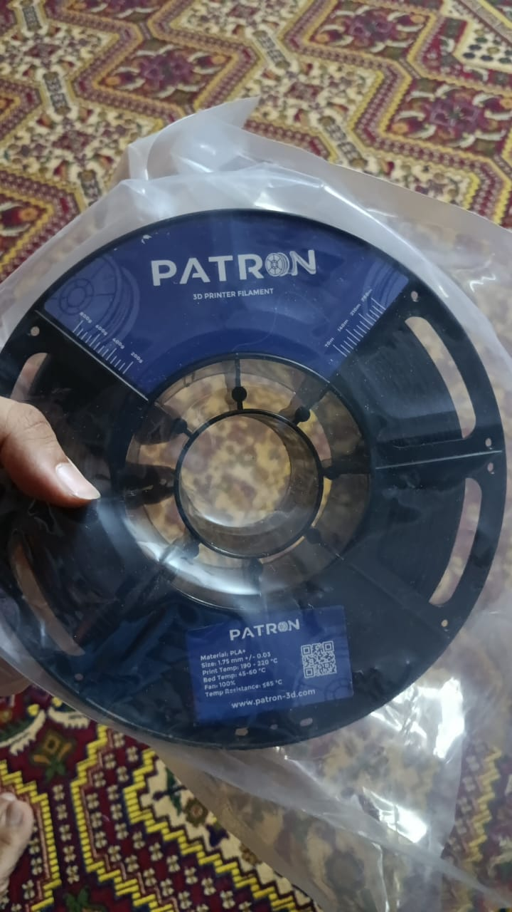

# 📚 Other Resources

This folder contains supplementary materials for **Team RCBC's** WRO Future Engineers robot, including raw component photos, power management devices, development screenshots, and team branding assets.

---

## 🎨 Team Branding

| Resource | Image | Description |
|-----------|-------|-------------|
| **Team Logo** |  | Official competition logo for Team RCBC (Reliable Chassis, Brilliant Code) |

---

## 🛠️ Electronic Components & Microcontrollers

| Component | Image | Description |
|-----------|-------|-------------|
| **Raspberry Pi 4 Model B** |  | Primary vision processor for real-time camera image analysis and path planning |
| **ESP32 Controller** |  | Secondary sensor fusion processor handling high-speed I/O and motor control |
| **Camera Module** |  | 8MP Sony IMX219 camera for color space masking and obstacle detection |
| **Ultrasonic Sensor** |  | HC-SR04 sensor used for front and side obstacle distance measurement |

---

## ⚙️ Actuators, Power & Materials

| Component | Image | Description |
|-----------|-------|-------------|
| **Drive Motor** |  | JGA25-370 high-torque DC gear motor for propulsion |
| **Servo Motor** |  | Metal-gear MG966R servo for precise Ackermann steering control |
| **Buck Converter** |  | Step-down voltage regulator for stable 5V/3.3V power distribution |
| **LiPo Batteries** |  | Rechargeable high-discharge LiPo battery pack |
| **3D Printing Filament** |  | High-durability PLA+ filament used for custom chassis fabrication |

---

## 🛠️ Experienced Problems & Implemented Solutions

During the development of Team RCBC's vehicle, we encountered several key engineering challenges:

1. **Power Circuit Isolation Issue**:
   * **Problem**: The secondary voltage rail remained energized when the master switch was off, leading to standby battery discharge.
   * **Solution**: Remapped the LDO input lines directly behind the primary hardware switch, ensuring complete isolation when switched off.

2. **Sensor Field of View (FoV) Interference**:
   * **Problem**: Ground plane reflection occurred due to low chassis clearance.
   * **Solution**: Added a physical upward angle bias to the sensor mounts to optimize detection range up to 300 cm.

3. **Color Space Lighting Sensitivity**:
   * **Problem**: Fluctuations in ambient venue lighting affected color detection stability.
   * **Solution**: Replaced standard RGB masking with HSV color space filtering and dynamic threshold calibration routines.

---

## 🔗 Related Documentation

* 🏎️ **Vehicle Layout & Photos**: [Car Photos Documentation](../Car_Photos/README.md)
* ⚙️ **Mechanical Design & 3D Models**: [Mechanical Design Documentation](../Mechanical_Design/README.md)
* 💻 **Software & Core Algorithms**: [Software Documentation](../software/README.md)
* 📸 Follow us on **[Instagram](https://www.instagram.com/anti.wro/)** • 🎥 **[YouTube Channel](https://www.youtube.com/@WRO_RCBC_EGYPT)**
